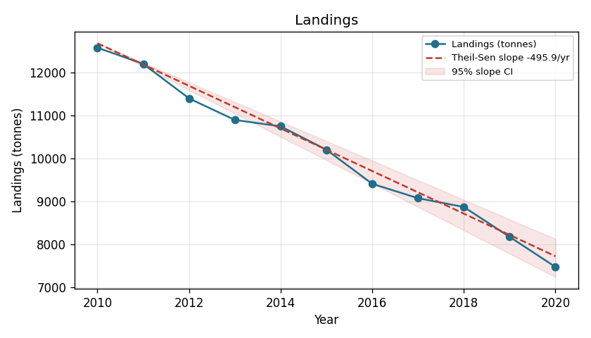
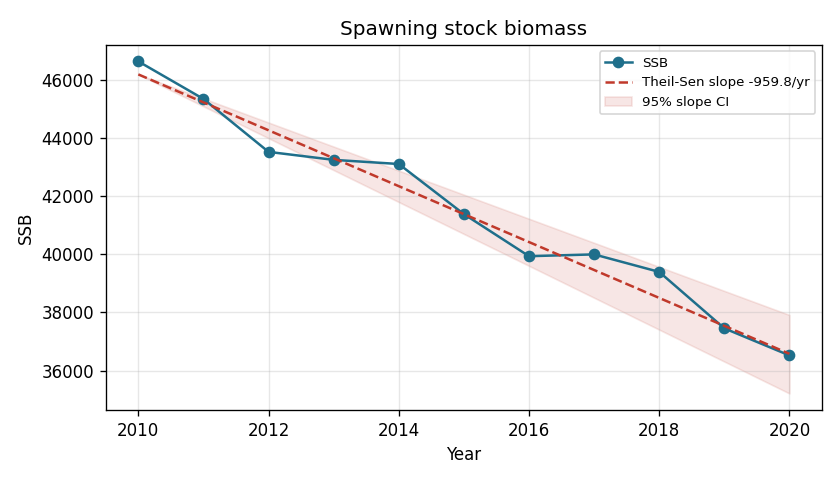
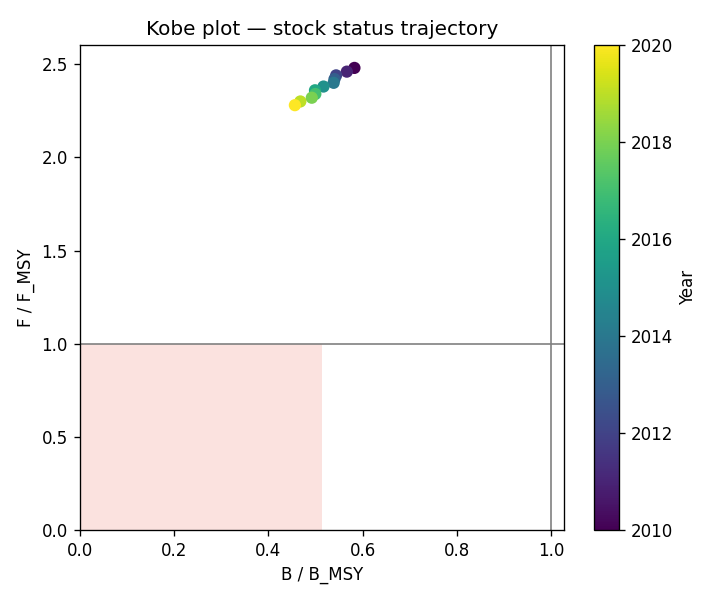
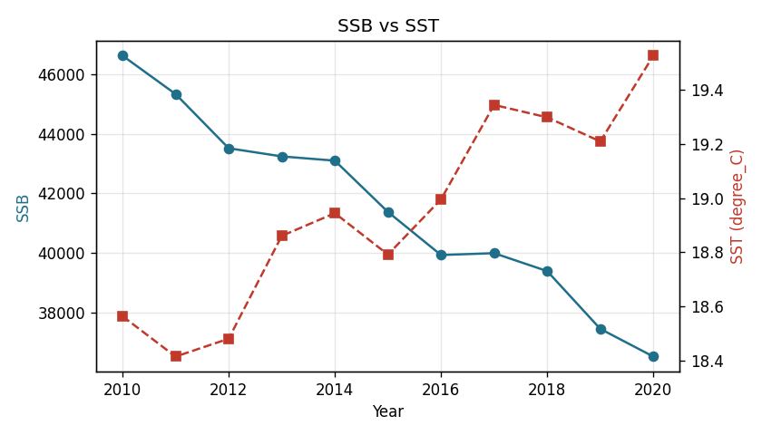

# Fisheries Research Report — run `20260710T115836-a3c812`

**Question:** Assess stock status and environmental drivers of European hake in FAO 37.2, 2010-2020

*Generated: 2026-07-10T11:58:37.093825+00:00*

**Scope:** Merluccius merluccius | areas 37.2 | 2010–2020

## Figures

*Figure fig-landings: Landings over time with Theil-Sen trend and 95% CI. Source: landings connectors.*

*Figure fig-ssb: Spawning stock biomass over time with Theil-Sen trend and 95% CI. Source: assessment connectors.*

*Figure fig-kobe: Stock-status trajectory in Kobe space (B/B_MSY vs F/F_MSY); lower-right is healthy. Source: assessment connectors.*

*Figure fig-covariate-overlay: SSB overlaid with SST (degree_C). Association is not causal. Source: assessment + ocean connectors.*

## Summary

This report addresses: Assess stock status and environmental drivers of European hake in FAO 37.2, 2010-2020. It synthesizes 7 quantitative results and 2 references. All numeric claims are grounded in the cited source records.

## Methods

Trends were tested with the Mann-Kendall test and Theil-Sen slope; stock status was classified against MSY reference points (Kobe quadrants); covariate associations used lagged cross-correlation with a Bonferroni-adjusted p-value. All statistics are computed by deterministic, unit-tested functions; associations are not causal.

## Results

Landings show a decreasing trend (Mann-Kendall p=2.62e-05; Theil-Sen slope -495.9 tonnes/yr, 95% CI [-544.4, -455.7]). [A1]
Spawning stock biomass shows a decreasing trend (Mann-Kendall p=5.16e-05; Theil-Sen slope -959.8/yr). [A2]
As of 2020, Merluccius merluccius in 37.2 is classified 'both': biomass below B_MSY and F above F_MSY. [A3]

## Environmental drivers

SST lags landings by 1 yr at peak association (r=-0.97, Bonferroni-adjusted p=3.73e-05). Associational only — not causal. Best lag selected post hoc over 9 lags; reported p adjusted by Bonferroni (×9). n=10 aligned observations. [A4]
SST lags SSB by 1 yr at peak association (r=-0.98, Bonferroni-adjusted p=1.34e-05). Associational only — not causal. Best lag selected post hoc over 9 lags; reported p adjusted by Bonferroni (×9). n=10 aligned observations. [A5]
CHLOR_A is concurrent with landings at peak association (r=0.83, Bonferroni-adjusted p=0.0139). Associational only — not causal. Best lag selected post hoc over 9 lags; reported p adjusted by Bonferroni (×9). n=11 aligned observations. [A6]
CHLOR_A lags SSB by 4 yr at peak association (r=0.87, Bonferroni-adjusted p=0.098). Associational only — not causal. Best lag selected post hoc over 9 lags; reported p adjusted by Bonferroni (×9). n=7 aligned observations. [A7]

## Literature

The literature includes "Stock status and warming-linked distribution shifts of European hake in the central Mediterranean" (2019), relevant to these findings. [L1]
The literature includes "Mediterranean sea surface temperature trends 2000–2020 and implications for demersal fisheries" (2021), relevant to these findings. [L2]

## Limitations

No major limitations identified.

## Citations

| Marker | Kind | Reference ID | Detail |
|---|---|---|---|
| [A1] | analysis | `trend-landings-merluccius-merluccius-37.2` | Landings of Merluccius merluccius in 37.2 (2010-2020) |
| [A2] | analysis | `trend-ssb-merluccius-merluccius-37.2` | SSB of Merluccius merluccius in 37.2 (2010-2020) |
| [A3] | analysis | `status-merluccius-merluccius-37.2` | Stock status of Merluccius merluccius in 37.2 (2020) |
| [A4] | analysis | `assoc-sst-landings-37.2` | SST vs landings in 37.2 |
| [A5] | analysis | `assoc-sst-SSB-37.2` | SST vs SSB in 37.2 |
| [A6] | analysis | `assoc-chlor_a-landings-37.2` | CHLOR_A vs landings in 37.2 |
| [A7] | analysis | `assoc-chlor_a-SSB-37.2` | CHLOR_A vs SSB in 37.2 |
| [L1] | reference | `sample_lit-1` | Stock status and warming-linked distribution shifts of European hake in the central Mediterranean |
| [L2] | reference | `sample_lit-2` | Mediterranean sea surface temperature trends 2000–2020 and implications for demersal fisheries |

## Data Sources

| Source | Query/URL | Retrieved | # records |
|---|---|---|---|
| sample_landings | sample_landings | 2026-07-10 | 11 |
| sample_assessment | sample_assessment | 2026-07-10 | 11 |
| sample_ocean | sample_ocean | 2026-07-10 | 2 |
| sample_literature | sample_literature | 2026-07-10 | 2 |

---

_Generated by Fisheries Research Agents. Every quantitative claim is grounded in a cited source record; see `report.json` for the full machine-readable audit trail._
